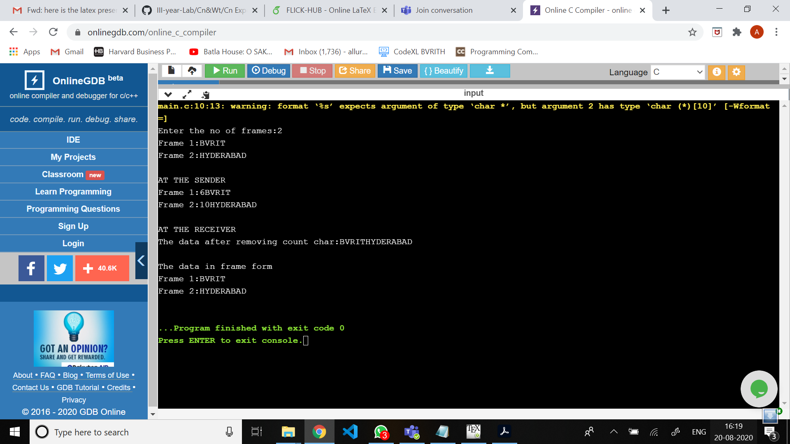

# Experiment 1

## Aim of the Experiment
To impliment data link layer framing techniques such as
i.character count ii.character stuffing and iii. bit stuffing

### step by step procedure of experiment
1. First scan the number of frames required.
2. Find string length of each frames
3. Print the Frames at Sender.
4. Print  the Data Transmitted.

### Output

